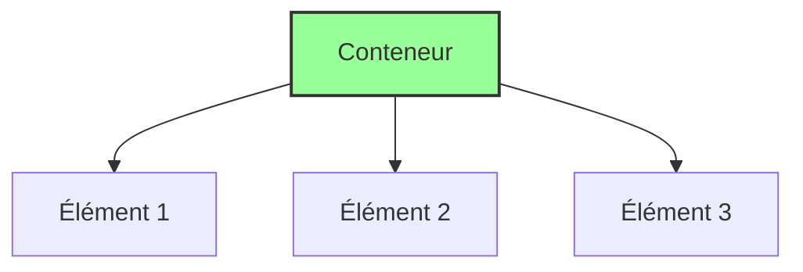

# 03-Css

Voici une brève explication des bases de Flexbox, Grid, positionnement, alignement et de la conception responsive :

1. **Flexbox** (Boîtes flexibles) : Flexbox est un modèle de disposition CSS conçu pour organiser les éléments dans un conteneur de manière flexible et dynamique. Il permet de créer des mises en page fluides et réactives. Les principales propriétés de Flexbox sont :
   * `display: flex;` : Appliqué au conteneur parent pour activer Flexbox.
   * `flex-direction` : Définit la direction principale dans laquelle les éléments se répartissent (row, column, row-reverse, column-reverse).
   * `justify-content` : Aligne les éléments le long de l'axe principal (horizontalement pour row, verticalement pour column).
   * `align-items` : Aligne les éléments le long de l'axe transversal (verticalement pour row, horizontalement pour column).
   * `flex` : Définit la flexibilité d'un élément et sa capacité à se développer ou à se réduire.
2. **Grid** (Grille) : CSS Grid est un système de disposition bidimensionnel qui permet de créer des mises en page complexes en alignant les éléments dans des lignes et des colonnes. Les principales propriétés de Grid sont :
   * `display: grid;` : Appliqué au conteneur parent pour activer CSS Grid.
   * `grid-template-columns` et `grid-template-rows` : Définissent la taille et la répartition des colonnes et des lignes.
   * `grid-gap` : Définit l'espace entre les cellules de la grille.
   * `grid-column` et `grid-row` : Positionnent les éléments individuels dans la grille.
3. Positionnement et alignement :
   * `position` : Propriété CSS utilisée pour contrôler le positionnement des éléments. Les valeurs courantes sont `static`, `relative`, `absolute`, `fixed` et `sticky`.
   * `top`, `right`, `bottom`, `left` : Ces propriétés sont utilisées avec `position: absolute;` ou `position: fixed;` pour spécifier la distance de l'élément par rapport à ses bords parents.
   * `margin` : Définit les marges autour d'un élément pour créer de l'espace entre les éléments adjacents.
   * `padding` : Définit l'espace interne à l'intérieur des éléments.
4. Conception **responsive** : La conception responsive consiste à créer des sites Web qui s'adaptent automatiquement à différents appareils et tailles d'écran, offrant une expérience utilisateur cohérente sur mobile, tablette et ordinateur de bureau. Pour réaliser une conception responsive, on utilise principalement :
   * Les **médias queries** (requêtes médias) : Permettent d'appliquer des styles CSS spécifiques en fonction de la taille de l'écran.
   * Les unités flexibles (em, rem) : Permettent de définir les dimensions et les marges en fonction de la taille de police racine ou de l'élément parent.

En utilisant ces concepts, vous pouvez créer des mises en page flexibles et réactives, positionner et aligner les éléments de manière précise et assurer que votre site s'adapte de manière optimale à différents appareils et résolutions d'écran.

***

#### Schéma

