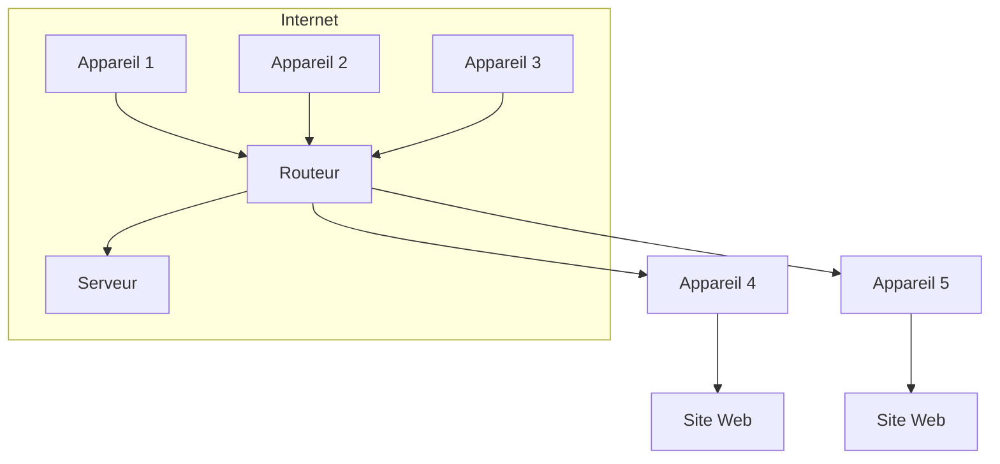

# 00-Intro

#### Cours

Les bases du web et les fondamentaux d'Internet couvrent plusieurs concepts essentiels pour comprendre le fonctionnement du World Wide Web et du réseau Internet. Voici une liste des principaux éléments à connaître&#x20;

`Internet` : Internet est le réseau mondial de réseaux informatiques interconnectés qui permettent la communication et l'échange d'informations entre les ordinateurs et appareils connectés à travers le monde.

`Protocoles` : Les protocoles sont des règles et des normes de communication qui permettent aux appareils de se comprendre et d'échanger des données sur Internet. Le protocole TCP/IP est essentiel pour le fonctionnement d'Internet.

`Adresse IP` : Chaque appareil connecté à Internet possède une adresse IP unique (Internet Protocol) qui permet de l'identifier sur le réseau.

`DNS` (Domain Name System) : Le DNS est un système qui traduit les noms de domaine (comme www.example.com) en adresses IP. Cela permet aux utilisateurs d'accéder aux sites web en utilisant des noms faciles à mémoriser plutôt que des adresses IP numériques.

`Site web` : Un site web est un ensemble de pages web qui contiennent du contenu, tel que du texte, des images, des vidéos, etc. Les sites web sont hébergés sur des serveurs et accessibles via des navigateurs web.

`Navigateur web` : Un navigateur web est une application logicielle qui permet aux utilisateurs d'accéder et de naviguer sur Internet. Les navigateurs affichent les pages web, interprètent le code HTML/CSS/JavaScript et permettent aux utilisateurs de cliquer sur des liens, de remplir des formulaires, etc.

`HTML` (Hypertext Markup Language) : HTML est le langage de balisage utilisé pour créer la structure et le contenu des pages web. Il utilise des balises pour définir le texte, les images, les liens, les formulaires, etc.

`CSS` (Cascading Style Sheets) : CSS est utilisé pour styliser les pages web en définissant la mise en page, les couleurs, les polices, etc. séparément du contenu HTML.

`JavaScript` : JavaScript est un langage de programmation côté client utilisé pour rendre les pages web interactives en permettant l'exécution de scripts dans le navigateur de l'utilisateur.

`Serveur web` : Un serveur web est un ordinateur ou un système qui stocke les fichiers et les ressources nécessaires pour rendre un site web accessible sur Internet. Il répond aux demandes des navigateurs web en envoyant les fichiers appropriés pour afficher les pages demandées.

Ces concepts de base du web et d'Internet constituent les fondements de la navigation et du développement web. Comprendre ces éléments est crucial pour acquérir une connaissance solide du fonctionnement du World Wide Web et pour se lancer dans le développement web.

***

#### Schéma

Ce schéma représente Internet (le réseau global) avec différents appareils (1, 2, 3) connectés à un routeur qui est relié à un serveur. De plus, le routeur est également connecté à deux autres appareils (4, 5), chacun accédant à un site web différent.
